  
  &nbsp;
  
  &nbsp;
  

[linkedin](https://www.linkedin.com/in/jd314/) &nbsp;·&nbsp;
[github](https://github.com/jd314) &nbsp;·&nbsp;
[email](mailto:david.brpo@hotmail.com)

> Physics student & undergraduate researcher in Optics and Photonics at Universidad de Antioquia (UdeA), Colombia. 
> Bridging experimental physics, mathematical modeling, scientific computing, and data intelligence from first principles.

I investigate physical phenomena across their complete lifecycle — from **laboratory instrumentation and theoretical modeling** to **computational simulation, high-throughput data acquisition, and machine learning**.

As a researcher in the **Optics and Photonics Group (UdeA)**, my academic background in physics, mathematics, and experimental research has developed my ability to approach complex problems from foundational laws, while building reproducible computational tools, automated workflows, and analytical systems to solve them.

<samp>python &nbsp; c++ &nbsp; matlab &nbsp; pytorch &nbsp; scikit-learn &nbsp; pandas &nbsp; numpy &nbsp; scipy &nbsp; opencv &nbsp; mlops &nbsp; docker &nbsp; git &nbsp; linux</samp>

**Physics & Optics** &nbsp;·&nbsp; <samp>optical systems, instrumentation, experimental design, theoretical modeling</samp> 
**Computation & Sim** &nbsp;·&nbsp; <samp>numerical methods, scientific programming, simulations, automated workflows</samp> 
**Data & AI Systems** &nbsp;·&nbsp; <samp>machine learning, MLOps, data engineering, ETL pipelines, business intelligence</samp>

**[optics-photonics-research](https://github.com/jd314)** &nbsp;·&nbsp; <samp>python, numpy, scipy, matplotlib</samp> 
Computational modeling, wave propagation simulations, and experimental data acquisition pipelines for optics and photonics research.

**[scientific-data-pipelines](https://github.com/jd314)** &nbsp;·&nbsp; <samp>python, pandas, mlops, docker</samp> 
End-to-end automated pipelines for physical experiment logging, data processing, statistical validation, and reproducible scientific workflows.

**[ml-physical-modeling](https://github.com/jd314)** &nbsp;·&nbsp; <samp>python, pytorch, scikit-learn</samp> 
Physics-informed and data-driven models bridging physical systems with machine learning and analytical inference.

Profile concept & generative visual engine inspired by <a href="https://github.com/andriidrok1">@andriidrok1</a>

